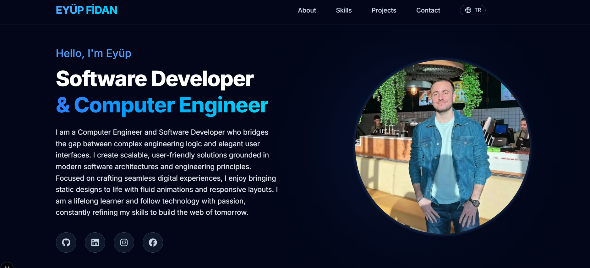
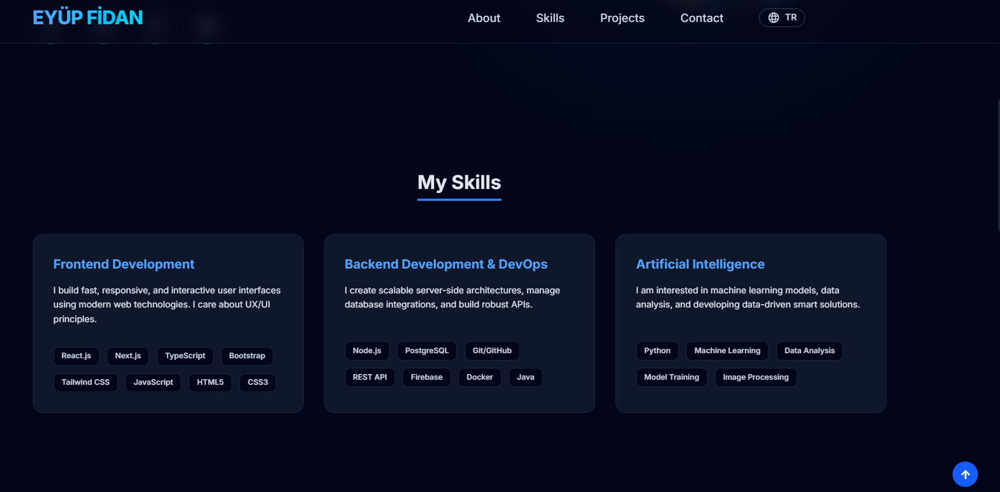
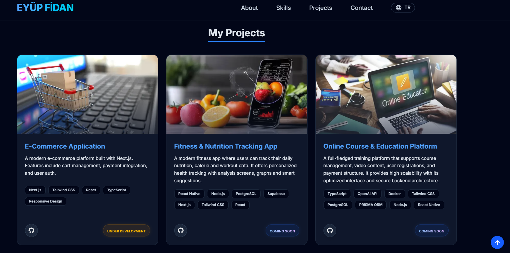
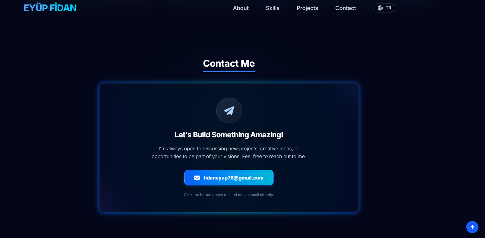
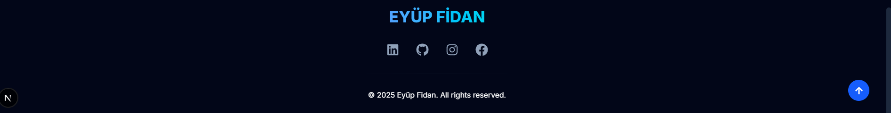

# Eyüp Fidan | Personal Portfolio Website

<div align="center">

</div>

<br />

## About The Project

This project is a high-performance, responsive, and bilingual **Personal Portfolio Website** designed to showcase my skills, projects, and professional background as a **Software Developer & Computer Engineer**.

Built with **Next.js 14 (App Router)** and styled with **Tailwind CSS**, the site features a premium dark aesthetic, smooth animations, and a seamless user experience across all devices.

### Key Features

* **Bilingual Support:** Fully integrated English/Turkish language toggle using React Context API (`LanguageContext`).
* **Premium UI/UX:** Modern dark theme with glassmorphism effects, gradient borders, and glowing animations.
* **Fully Responsive:** Mobile-first architecture ensuring perfect layout on phones, tablets, and desktops.
* **High Performance:** Optimized with Next.js Image component and lightweight code structure.
* **Secure Contact:** Static `mailto` integration to prevent spam and ensure direct communication without backend vulnerabilities.
* **Modular Component Architecture:** Clean and maintainable code structure (`Hero`, `Skills`, `Projects`, `Contact`).

## Visual Tour

### 1. Hero / About Section

*A captivating introduction with glowing effects and social media integration.*



### 2. My Skills

*Categorized technical skills (Frontend, Backend, AI) presented in interactive cards.*



### 3. Projects Showcase

*A detailed display of my recent works with status badges (Under Development / Coming Soon).*



### 4. Contact Area

*A sleek, secure, and static contact section with premium hover effects.*



### 5. Footer

*Minimalist and functional footer with quick navigation.*



## Tech Stack

| Category | Technologies | 
 | ----- | ----- | 
| **Framework** | Next.js 14 (App Router) | 
| **Core** | React.js, TypeScript | 
| **Styling** | Tailwind CSS, CSS Modules | 
| **Icons** | React Icons (FontAwesome, Material Design) | 
| **State Management** | React Context API (Custom Language Provider) | 
| **Deployment** | Vercel (Recommended) | 

## Getting Started

To run this project locally, follow these steps:

1. **Clone the repository**

   ```bash
   git clone [https://github.com/eyup-fidan/mywebsite.git](https://github.com/eyup-fidan/mywebsite.git)

2.Navigate to the project directory

      ```bash
      cd mywebsite

3.Install dependencies

      ```bash
      npm install
      # or
      yarn install

4.Start the development server

      ```bash
      npm run dev

5.Open http://localhost:3000 in your browser.

Contact
I am always open to discussing new projects, creative ideas, or opportunities to be part of your visions.

Email: fidaneyup76@gmail.com

LinkedIn: [Eyüp Fidan](https://www.linkedin.com/in/ey%C3%BCp-fidan-114386220/)

GitHub: https://github.com/eyup-fidan

<div align="center"> <p>© 2025 Eyüp Fidan. All rights reserved.</p> <p>Built with Next.js</p> </div>


